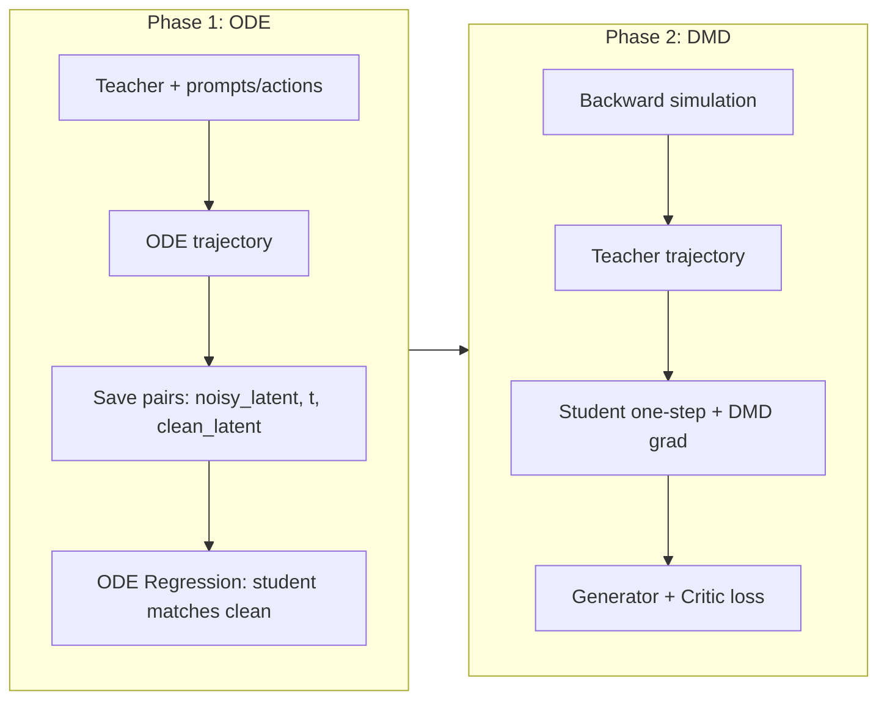

# Causal DMD for Wan Action-Conditioned Model

## 现状与依赖

- **Teacher**：当前 [diffsynth/models/wan_video_action_dit.py](diffsynth/models/wan_video_action_dit.py) 中的 `WanVideoActionDiT` 继承 [wan_video_dit.py](diffsynth/models/wan_video_dit.py) 的 `WanModel`，使用双向 `SelfAttention`（flash_attention），无 KV cache；时间+动作调制为 `total_mod = t_mod + a_mod`，按 token 维度 `(B, T, 6, dim)`。
- **CausVid 差异**：见 [changing_to_causal.md](chat_with_ai/changing_to_causal.md)。核心是：forward 按 `kv_cache` 分支为 `_forward_inference` / `_forward_train`；Self-Attn 为因果（训练用 block_mask/flex_attention，推理用 kv_cache + causal_rope）；Head 用 per-frame `e`；需 `block_mask`、`num_frame_per_block`、`current_start/current_end`。
- **diffsynth 与 CausVid 的 Wan 实现不同**：diffsynth 使用 `DiTBlock` + `SelfAttention`（单次 flash_attention），patchify 后需得到 `(B, T, dim)` 与 grid `(f,h,w)`；CausVid 使用 `WanModel` + `WanSelfAttention`，序列组织与 RoPE 格式也不同。因此 student 需在 **diffsynth 现有 Wan/WanVideoActionDiT 之上** 改因果，而不是直接复用 CausVid 的 `causal_model.py`。

---

## A. Student 模型设计与推理程序

### A.1 新增代码与位置（尽量新文件）

| 新增内容                                 | 建议路径                                                      | 说明                                                               |
| ------------------------------------ | --------------------------------------------------------- | ---------------------------------------------------------------- |
| 因果 Self-Attn + Block + 因果 Action DiT | `diffsynth/models/causal_wan_video_action_dit.py`         | 新建，实现 CausalSelfAttention、CausalDiTBlock、CausalWanVideoActionDiT |
| 因果推理 pipeline / 入口                   | `Wan_action_fintune/inference/causal_action_inference.py` | 新建，加载 causal action 模型、建 KV cache、按块推理并写调用示例                     |

不在现有 `wan_video_dit.py` / `wan_video_action_dit.py` 里大改，仅在新文件中从 `WanVideoActionDiT` / `WanModel` 引用并扩展。

### A.2 `diffsynth/models/causal_wan_video_action_dit.py` 设计要点

- **从现有代码复用**：`WanVideoActionDiT` 的 `action_embedding`、`action_projection`，以及 `WanModel` 的 `patch_embedding`、`text_embedding`、`time_embedding`、`time_projection`、`img_emb`、`unpatchify`；RoPE 的 `precompute_freqs_cis_3d`、`rope_apply` 从 [wan_video_dit.py](diffsynth/models/wan_video_dit.py) 复用；CrossAttention、FFN、modulation 与现有 DiTBlock 对齐。
- **新增/替换**：
  - **causal_rope_apply**：仅对当前块对应帧起算 RoPE（参考 CausVid [causal_model.py](ys_26.2/2.27_CausVid/code/causvid/models/wan/causal_model.py) 的 `causal_rope_apply`），适配 diffsynth 的 `freqs` 为 `(f_freqs, h_freqs, w_freqs)` 与 `(B, T, n, d)` 的 q/k/v 格式。
  - **CausalSelfAttention**：接口增加 `kv_cache=None, current_start=0, current_end=0`；无 cache 时用 **因果 mask**（block-wise causal：当前块只能看当前块及之前块）。若不想引入 `flex_attention`，可用 `torch.nn.functional.scaled_dot_product_attention(..., is_causal=True)` 对「从 0 到 current_end」的序列做因果，或对整序列构造 block causal mask（mask 的构造参考 CausVid `_prepare_blockwise_causal_attn_mask` 的逻辑，用 attention mask 矩阵实现）。有 cache 时：当前块 q 用 causal_rope_apply；k/v 写入 `kv_cache["k"][:, current_start:current_end]`、`kv_cache["v"][:, current_start:current_end]`；attention 用 `q` 与 `kv_cache["k"][:, :current_end]`、`kv_cache["v"][:, :current_end]`（可用现有 flash_attention 或 SDPA，保证因果）。
  - **CausalDiTBlock**：与 [wan_video_dit.py](diffsynth/models/wan_video_dit.py) 的 `DiTBlock` 相同结构，但将 `SelfAttention` 换成 `CausalSelfAttention`，forward 多传 `kv_cache, current_start, current_end`；CrossAttention 与 FFN 不变。
  - **CausalWanVideoActionDiT**：
    - 继承或组合 `WanVideoActionDiT` 的 action 相关参数与 `WanModel` 的 backbone；`self.blocks` 改为 `nn.ModuleList([CausalDiTBlock(...)])`；Head 若需 per-frame 调制可沿用现有 `Head` 但传入按帧的 `e`（与 CausVid CausalHead 的 `e` shape 对齐），或先保持与 teacher 一致再后续加 CausalHead。
    - **forward 分支**：若 `kwargs.get('kv_cache', None) is not None` 则走 `_forward_inference(...)`，否则走 `_forward_train(...)`。
    - **_forward_train**：与当前 `WanVideoActionDiT.forward` 类似，全序列一次前向，但 block 内用 CausalSelfAttention + block causal mask（无 kv_cache）。
    - **_forward_inference**：按「块」（以 `num_frame_per_block` 为单位）循环：对当前块输入与 `current_start/current_end` 调用 blocks，传入 `kv_cache[block_index]`，在 CausalSelfAttention 内写/读 cache；时间/动作调制只对当前块 token 计算；最后拼出整段输出。
  - **状态**：`num_frame_per_block`、`block_mask`（训练用，若用 SDPA 则可为 attention mask 或 None）、`seq_len`/max_len 用于预分配 KV cache。
- **初始化**：可从 teacher（`WanVideoActionDiT`）的 state_dict 加载除 CausalSelfAttention 与 CausalDiTBlock 中与 causal 相关的新参数外的权重，实现「从 teacher 初始化 student」。

### A.3 KV cache 形状与推理约定

- 每层一个 `{"k": (B, max_T, num_heads, head_dim), "v": (B, max_T, num_heads, head_dim)}`；max_T 取整段视频 patch 数（如 `num_frames * h * w`）。
- 推理时按块递增 `current_start`、`current_end`（块内 token 数 = `num_frame_per_block * h * w`），与 CausVid [causal_inference.py](ys_26.2/2.27_CausVid/code/causvid/models/wan/causal_inference.py) 一致。

### A.4 推理程序 `Wan_action_fintune/inference/causal_action_inference.py`

- 加载：CausalWanVideoActionDiT、VAE、text encoder、action encoder（若推理需要）、scheduler（与 teacher 一致，如 FlowMatch）。
- 输入：prompt、首帧图（若 I2V）、action 序列 `(B, T_act, action_dim)`。
- 流程：
  1. 编码 prompt、首帧、action（得到 context、clip_feature、y、action_emb）。
  2. 初始化 KV cache：`_initialize_kv_cache(batch_size, num_blocks, max_T, num_heads, head_dim, dtype, device)`。
  3. 按 denoising 步循环；每步内按**时间块**循环：当前块噪声 latent + 对应 action 段 → 调用 `CausalWanVideoActionDiT(..., kv_cache=kv_cache, current_start=..., current_end=...)` → 用 scheduler 更新 latent；最后一步后用 timestep=0 再跑一遍以更新 cache（与 CausVid 一致）。
  4. 解码 latent → 视频。
- 输出：生成视频（及可选 latents）；脚本内包含最小可运行示例（如单条 prompt + 单条 action 序列）。

---

## B. 蒸馏 pipeline（ODE 轨迹 + DMD）

全部放在 `**Wan_action_fintune/distill/dmd/`** 下，参照 CausVid 的 [ode_regression.py](ys_26.2/2.27_CausVid/code/causvid/ode_regression.py)、[dmd.py](ys_26.2/2.27_CausVid/code/causvid/dmd.py)、[train_ode.py](ys_26.2/2.27_CausVid/code/causvid/train_ode.py)、[train_distillation.py](ys_26.2/2.27_CausVid/code/causvid/train_distillation.py)、[bidirectional_trajectory_pipeline.py](ys_26.2/2.27_CausVid/code/causvid/bidirectional_trajectory_pipeline.py)。

### B.1 两阶段流程（与 CausVid 对齐）

### B.2 建议文件布局（均在 `Wan_action_fintune/distill/dmd/`）

| 文件                                    | 职责                                                                                                                                                                                                                                                                                                                                                                                                 |
| ------------------------------------- | -------------------------------------------------------------------------------------------------------------------------------------------------------------------------------------------------------------------------------------------------------------------------------------------------------------------------------------------------------------------------------------------------- |
| `ode_trajectory.py`                   | 用 teacher（当前 WanVideoActionDiT + pipeline）对给定 prompt/action 生成完整 ODE 轨迹 `[noise, x_1, ..., x_T]`，并支持写入 LMDB 或返回 in-memory，供 ODE 阶段使用。                                                                                                                                                                                                                                                              |
| `ode_regression.py`                   | `ODERegression` 类：读 ODE 轨迹（或 LMDB），随机采 `(noisy_latent, timestep)`，student 预测 x0，与 clean 做 MSE；支持 `causal_video` 的 timestep 同块一致（`_process_timestep`）；依赖 diffsynth scheduler、action encoder、text encoder。                                                                                                                                                                                           |
| `dmd.py`                              | `DMD` 类：generator=student（CausalWanVideoActionDiT），real_score=teacher（WanVideoActionDiT），fake_score=teacher（或 student）；`_compute_kl_grad`、`compute_distribution_matching_loss`；backward 时用 **action-conditioned** 的 trajectory（`_consistency_backward_simulation` 需传入 prompt+action，用 teacher rollout 得到轨迹）；`_process_timestep` 支持 `causal_video`；可选 normalizer 针对 causal teacher（见 CausVid TODO）。 |
| `backward_simulation.py`              | Action-conditioned 的 backward simulation：给定 noise、prompt、action，用 teacher 多步 denoise 得到 `[B, T_steps, F, C, H, W]` 轨迹，供 DMD 的 `_run_generator` 里随机采一步作为 generator 输入。                                                                                                                                                                                                                              |
| `train_ode.py`                        | ODE 阶段训练脚本：加载 ODE 数据（LMDB 或 dataset 返回 trajectory + prompt + action），ODERegression，优化 student；可参考 CausVid train_ode.py 的分布式与 checkpoint。                                                                                                                                                                                                                                                           |
| `train_dmd.py`                        | DMD 阶段训练脚本：DMD + backward_simulation，generator_loss + critic_loss，优化 student 与 critic；参考 CausVid train_distillation.py。                                                                                                                                                                                                                                                                            |
| `config_ode.yaml` / `config_dmd.yaml` | ODE / DMD 的 hyperparameters（batch_size、lr、denoising_step_list、num_frame_per_block、action_joint_dim、路径等）。                                                                                                                                                                                                                                                                                           |
| `README.md`                           | 说明两阶段顺序、数据格式、如何生成 ODE 数据、如何运行 train_ode 与 train_dmd。                                                                                                                                                                                                                                                                                                                                               |

### B.3 关键实现要点

- **ODE 轨迹数据**：每条样本需包含（或可解析出）prompt、action 序列、以及 teacher 产出的整条 latent 轨迹 `ode_latent [B, num_steps, F, C, H, W]`（从噪声到干净）。`ode_trajectory.py` 调用现有 pipeline + teacher，固定 scheduler 步数，逐步 step 得到轨迹；保存时带 prompt/action 以便 dataloader 构造 conditional_dict 与 action。
- **ODERegression**：与 CausVid 一致，从轨迹中随机采 timestep 与对应 noisy latent，student 单步预测 x0，target 为轨迹最后一步；loss 仅对 timestep≠0 的帧可做 mask（可选）。注意 student 为 causal，需传 `kv_cache=None` 走 _forward_train，且 timestep 在同一 block 内一致（`_process_timestep`）。
- **DMD backward simulation**：不能直接用 CausVid 的 `BidirectionalInferenceWrapper`（无 action）。在 `backward_simulation.py` 中实现 `inference_with_trajectory(noise, conditional_dict, action_emb_or_sequence)`，内部用 teacher + 同一 scheduler 步数循环，每步传入 action，得到轨迹张量；DMD 的 `_consistency_backward_simulation` 调用此函数并传入当前 batch 的 prompt/action。
- **real_score / fake_score**：均为 teacher（WanVideoActionDiT），forward 时传相同 conditional_dict 与 action；若 fake_score 用 student 则需在 config 中区分并保证 forward 接口一致（无 kv_cache）。

---

## 实现顺序建议

1. 实现 **CausalWanVideoActionDiT** 与 **CausalSelfAttention**（含训练分支的 causal mask 与推理分支的 kv_cache），并在单机单步 forward 上验证与 teacher 输出 shape 一致、因果 mask 正确。
2. 实现 **causal_action_inference.py**，单条样本端到端推理并核对 KV cache 更新与块边界。
3. 实现 **ode_trajectory.py** 与 **ode_regression.py**，跑通 ODE 阶段训练。
4. 实现 **backward_simulation.py** 与 **dmd.py**，再实现 **train_dmd.py**，跑通 DMD 阶段。

---

## 与现有代码的衔接

- **Pipeline**：现有 [wan_video.py](diffsynth/pipelines/wan_video.py) 的 `model_fn_wan_video` 当前接受 `dit` 与 `action_emb`。若要统一用 pipeline 做 teacher 的 backward 与 real/fake score，可保持 `dit` 为 teacher；student 仅在 ODE/DMD 的 training script 中直接调用 `CausalWanVideoActionDiT.forward`，不强制改 pipeline 的 model_fn（除非希望推理也走同一 pipeline，则需增加 causal + kv_cache 分支）。
- **direct_distill**：现有 [direct_distill/train_distill.py](Wan_action_fintune/distill/direct_distill/train_distill.py) 是「用已渲染好的教师视频 + 同一 prompt/action 训学生」；DMD 是「无预存视频、用教师 ODE 轨迹 + backward 模拟」训学生。两者并存，DMD 放在 `distill/dmd/` 独立于 direct_distill。

